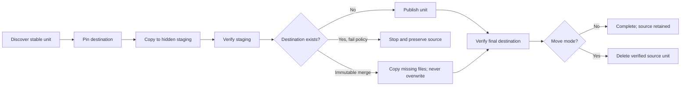

<div align="center">
  

  <p><strong>Branch-aware, fail-closed media archive orchestration powered by rclone.</strong></p>

  <p>
    <a href="README.zh-CN.md">简体中文</a> ·
    <a href="docs/ARCHITECTURE.md">Architecture</a> ·
    <a href="docs/OPERATIONS.md">Operations</a> ·
    <a href="SECURITY.md">Security</a>
  </p>

  [](https://github.com/yuanweize/atomic-sync/actions/workflows/ci.yml)
  [](https://github.com/yuanweize/atomic-sync/actions/workflows/codeql.yml)
  [](https://github.com/yuanweize/atomic-sync/releases)
  [](https://github.com/yuanweize/atomic-sync/pkgs/container/atomic-sync)
  [](LICENSE)
</div>

---

Atomic Sync moves a movie directory, a complete show, or one season as a single migration unit. It stages the unit, verifies it, publishes it, verifies the final destination again, and only then permits source cleanup.

It also understands the part a union filesystem hides: the same folder name on two mergerfs branches does **not** prove that the archive is complete. Atomic Sync compares the physical source and destination inventories and reports what is actually archived, partial, pending, conflicting, or empty.

## Why it exists

A command such as `rclone move --min-age 30d` evaluates age per file. A late subtitle, poster, or episode can remain behind while older files move first, splitting one media unit across storage providers.

Atomic Sync evaluates the newest file in the entire unit. A 30-day stable window means the complete directory must remain unchanged for 30 days before it becomes eligible.



## What makes it safe

- **Dry-run by default.** Omitted API values and the UI both create a dry run.
- **Fail-closed conflicts.** Existing destination units stop publication unless `merge-immutable` is explicitly selected.
- **Unit-safe cleanup.** Destructive move jobs cannot use file filters, so excluded files can never be swept away by unit-wide cleanup.
- **Immutable merge.** Missing files may be added, but an existing different file is never overwritten.
- **Two verification gates.** Source → staging and source → final destination are both checked.
- **No shell interpolation.** rclone is launched with an argument vector, not a shell command.
- **Deterministic placement.** A unit is pinned to one weighted destination in SQLite and stays there across retries.
- **Lifecycle-aware shutdown.** SIGTERM cancels active work, waits for workers, and marks interrupted records failed on restart while preserving staging.
- **Hardened container.** UID 1000, read-only root filesystem, zero Linux capabilities, no-new-privileges, and a dedicated state path.
- **Session-only UI token.** The SPA is public to load; protected APIs require a constant-time Bearer-token check. The token stays in `sessionStorage`.

## Branch-aware archive status

Atomic Sync lists each physical branch once and compares files inside every atomic unit by relative path and size. This is intentionally metadata-first so a dashboard scan does not read terabytes from a CIFS source. A destructive run still performs the configured checksum or size verification.

| Status | Meaning | Safe next action |
|---|---|---|
| `archived` | Destination has content; the source has no files (an empty directory shell may remain) | Confirm mount health and retain the audit record |
| `ready-to-verify` | Every source path and size exists at the destination, but the source still exists | Run final verification before cleanup |
| `partial` | The destination has the unit but is missing some source files | Immutable merge or investigate |
| `pending` | Source has files and the destination unit is absent | Archive candidate |
| `conflict` | The same relative path has a different size or file/directory type | Stop; select the authoritative copy |
| `empty` | Only an empty directory shell is visible | Review or ignore |

See [Archive analysis](docs/ARCHIVE-ANALYSIS.md) for mergerfs examples and the exact decision rules.

`archived` is inferred from the current physical inventories; it is not historical proof of a completed run. A successful empty source listing is valid after a complete archive, so verify the physical mount before analysis. The reference Compose file refuses to create missing bind sources, but it cannot distinguish a healthy empty share from an existing mountpoint whose filesystem is offline.

## Quick start

Requirements: Docker Engine with Compose v2 and an existing `rclone.conf`.

```bash
git clone https://github.com/yuanweize/atomic-sync.git
cd atomic-sync
mkdir -p data rclone source
cp /path/to/rclone.conf rclone/rclone.conf
cp .env.example .env
```

Generate a token and place it in `.env`:

```bash
openssl rand -hex 32
```

Ensure the dedicated state and config file are readable by the image's fixed UID/GID 1000. Never recursively change ownership of a shared media root.

```bash
sudo chown -R 1000:1000 data
sudo chown 1000:1000 rclone/rclone.conf
sudo chmod 600 rclone/rclone.conf
docker compose -f compose.yaml -f compose.dev.yaml up -d --build
docker compose ps
```

Open `http://127.0.0.1:8088`, enter the API token, and create a **dry-run copy** job first. The default source mount is `/sources/media` and is read-only.

### Production image

Release tags publish signed `linux/amd64` and `linux/arm64` images with SBOM and provenance attestations:

```yaml
services:
  atomic-sync:
    image: ghcr.io/yuanweize/atomic-sync:0.1.0@sha256:<release-digest>
```

Pin the digest from the release before deployment. Do not use `build: .` when embedding the service into an unrelated Compose project.

Each GitHub Release includes `image-digest.txt`, Linux binaries, and `SHA256SUMS`. The workflow makes the GHCR package public, verifies anonymous manifest access, attaches SBOM/provenance, and signs the immutable digest with GitHub OIDC. Verify a release before use:

```bash
IMAGE="$(cat image-digest.txt)"
docker pull "$IMAGE"
cosign verify "$IMAGE" \
  --certificate-identity-regexp '^https://github.com/yuanweize/atomic-sync/.github/workflows/release.yml@refs/tags/v[0-9]+\.[0-9]+\.[0-9]+$' \
  --certificate-oidc-issuer 'https://token.actions.githubusercontent.com'
sha256sum -c SHA256SUMS
```

## Configuration

| Variable | Default | Purpose |
|---|---:|---|
| `ATOMIC_LISTEN` | `127.0.0.1:8080` | HTTP listen address; the container explicitly sets `:8080` |
| `ATOMIC_DATA_DIR` | `/data` | SQLite and durable state directory |
| `ATOMIC_API_TOKEN` | empty | Bearer token; if set it must be at least 32 characters, and non-loopback listeners require it |
| `ATOMIC_RCLONE_BIN` | `rclone` | rclone executable path |
| `ATOMIC_MAX_CONCURRENCY` | `4` | Global transfer worker ceiling |
| `ATOMIC_LOG_FORMAT` | `json` | `json` or text structured logs |
| `RCLONE_CONFIG` | `/config/rclone/rclone.conf` | Explicit rclone configuration path |

The application never writes `.env` or `rclone.conf`. Jobs, assignments, runs, and branch analyses are stored in `atomic-sync.db`.

## Guarantees and boundaries

Atomic Sync provides a staged, verified publication protocol. Object-storage directory operations are not ACID transactions, and a remote `moveto` may be implemented as multiple object operations. On failure, the source is preserved and staging remains available for diagnosis.

`merge-immutable` is deliberately not fully atomic: it can add missing objects before a later conflict is discovered. It never overwrites a different destination object and never deletes the source until final verification succeeds.

SQLite makes one Atomic Sync instance the supported topology. Do not run multiple replicas against the same database.

## Documentation

- [Architecture and state machine](docs/ARCHITECTURE.md)
- [Branch-aware archive analysis](docs/ARCHIVE-ANALYSIS.md)
- [Production operations and rollback](docs/OPERATIONS.md)
- [HTTP API](docs/API.md)
- [Threat model](docs/SECURITY-MODEL.md)
- [Contributing](CONTRIBUTING.md)
- [Security policy](SECURITY.md)

## Development

Go 1.25 or newer is required.

```bash
gofmt -w .
go vet ./...
go test -race -cover ./...
ATOMIC_API_TOKEN="$(openssl rand -hex 32)" docker compose config
docker build -t atomic-sync:dev .
```

The critical engine, API, model, store, and configuration packages are covered by unit and integration-style tests, including dry-run, fail-closed conflict, immutable merge, shutdown, authentication, and mergerfs branch-status scenarios.

## Roadmap

- Scheduled polling and filesystem watch adapters
- Checksum-on-demand for selected analysis units
- Resume and guided cleanup for retained staging
- Prometheus metrics, notifications, and fine-grained RBAC
- Multi-node agents for remote NAS push workflows

Atomic Sync is released under the [MIT License](LICENSE).
