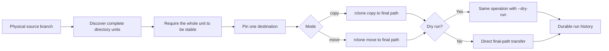

<div align="center">
  

  <p><strong>Directory-unit file transfers, powered end to end by rclone.</strong></p>

  <p>
    <a href="README.zh-CN.md">简体中文</a> ·
    <a href="docs/ARCHITECTURE.md">Architecture</a> ·
    <a href="docs/OPERATIONS.md">Operations</a> ·
    <a href="SECURITY.md">Security</a>
  </p>

  [](https://github.com/yuanweize/Atomic-Sync/actions/workflows/ci.yml)
  [](https://github.com/yuanweize/Atomic-Sync/actions/workflows/codeql.yml)
  [](https://github.com/yuanweize/Atomic-Sync/releases)
  [](https://github.com/yuanweize/atomic-sync/pkgs/container/atomic-sync)
  [](LICENSE)
</div>

---

Atomic Sync is a focused control plane for copying or moving mature directory trees from a local or CIFS-mounted source branch to a supported rclone destination. It groups regular files at a fixed directory boundary, waits until the whole unit is stable, pins its destination, and lets rclone perform the data transfer directly. General-purpose `folder` and `depth` policies work for project trees, datasets, exports, build artifacts, and other directory-organized content; `show` and `season` are convenient media-library hierarchy presets.

This solves two problems that a single transfer command cannot:

- a late file should reset the age of its complete directory unit, instead of splitting one logical tree across storage;
- the merged view from mergerfs can hide whether two same-named directories are fully archived, partially overlapping, conflicting, or empty.

Atomic Sync does not replace rclone, proxy file contents, or implement a second cloud client. Rclone is the sole data plane; Atomic Sync provides policy, directory-unit grouping, destination assignment, branch analysis, history, and a guarded web control plane around it. It is deliberately not an individual-file synchronizer: loose files directly under `job.source` are above every supported unit boundary and make discovery fail closed.

The payload contract is intentionally narrower than a filesystem backup. Atomic Sync inventories regular files inside directory units; it does not follow or preserve symbolic links or special files, guarantee empty-directory retention, or preserve ownership, permissions, extended attributes, and other POSIX metadata. The `show` and `season` presets only choose one- and two-level directory boundaries—they do not parse or rename media, or decide whether episodes and seasons are complete.

## Two modes, deliberately

| Mode | Data operation | Source after success | Destination-only files |
|---|---|---|---|
| `copy` | Direct rclone copy to the final destination | Preserved | Never pruned |
| `move` | Direct rclone move to the final destination | Removed by rclone after successful transfer | Never pruned |

There is no third `sync` mode. In rclone terminology, `sync` is a **one-way mirror** that may delete destination-only files; it is not bidirectional synchronization. Atomic Sync never needs that destructive destination-pruning behavior. True bidirectional replication is a different product category, and Syncthing is an independent implementation—not a layer built on rclone.

## Why a directory tree is the unit

`rclone move --min-age 30d` evaluates individual files. If one file was written 40 days ago but a related file arrived yesterday, the older file can move first and split one logical directory tree across branches.

Atomic Sync evaluates the newest modification time inside the complete directory unit. Choose a general policy or a media preset:

```text
Folder (`folder`)         → Project/                    general purpose
Custom depth (`depth`)    → Org/Project/                general purpose, exactly N components
TV show (`show`)          → Show/                       media preset
TV season (`season`)      → Show/Season 01/             media preset
```

Every transferable file must live below the selected boundary. For example, `folder` accepts `Project/report.pdf` but rejects a loose `report.pdf` directly under `job.source`; `depth: 2` requires a shape such as `Org/Project/report.pdf`. Atomic Sync currently has no root-file or per-file grouping mode.

The default stable window is **30 days** (`2,592,000` seconds). A three-day window (`259,200` seconds) is appropriate only for a tightly scoped dry-run or canary; it is not the project default. When the window is positive, the same value is also passed to rclone as `--min-age <seconds>s` as a final age guard.



## Designed for fast, observable transfers

- **Rclone all the way down.** Retries, provider pacing, resumable transfers, checks, and Drive behavior stay in the mature rclone engine.
- **Direct final-path I/O.** Each unit is transferred once, straight to its assigned final destination.
- **No destination mirror deletion.** Neither mode invokes rclone `sync`.
- **Real dry-run by default.** The same rclone operation checks both endpoints with `--dry-run`; source and destination data objects are unchanged, though rclone may refresh OAuth tokens in its dedicated config.
- **Fail-closed unit discovery.** Shallow files, path traversal, ambiguous parent/child units, endpoint overlap, and reserved internal paths stop execution.
- **Immutable conflict handling.** The default policy stops on an existing unit; the opt-in merge policy adds missing files without overwriting a different destination object.
- **Deterministic placement.** Weighted destination assignments are persisted in SQLite and reused across retries.
- **Bounded concurrency.** Job workers, process-wide rclone concurrency, transfers, checkers, and provider transactions are separately limited.
- **Guided bilingual editor.** Human-readable stable windows, visible multi-destination routing, media presets, progressive advanced controls, and a live behavior summary reduce configuration guesswork.
- **Hardened deployment.** The reference container runs as UID/GID 1000 with a read-only root filesystem, zero capabilities, and `no-new-privileges`.

Direct transfer is intentional. A cross-provider move is not an ACID directory rename: rclone transfers and accounts for objects individually, and an interruption can leave a partially completed unit. Immediately before rclone starts, Atomic Sync re-lists the source and requires it to match the discovery fingerprint. It writes those discovered file paths to a temporary `--files-from-raw` manifest, so rclone transfers exactly that set instead of sweeping in a file that arrives after revalidation. The manifest is deleted when the operation ends; it is control data, not staging or a payload copy. After every non-dry-run copy or move, Atomic Sync lists the final destination and requires every discovered file path and size to be present; move then checks source residue. This avoids a second content transfer and can reduce repeated source traversal, but the metadata closure does not lock writers or prove an in-place, equal-size rewrite that preserves its old modification time. Production moves still require quiesced writers.

## Branch-aware archive status

A mergerfs path can combine files from StorageBox and GD into one apparently complete directory. Atomic Sync instead lists each physical branch and compares relative paths and sizes inside the assigned unit.

| Status | Physical meaning | Operational interpretation |
|---|---|---|
| `archived` | Destination has files and the source has none | The unit currently lives on the archive branch; confirm mount health |
| `ready-to-verify` | Every source path and size exists at the destination; source still has files | Duplicate-looking unit ready for an explicit verification decision |
| `partial` | The destination has content but is missing one or more source files | Transfer is incomplete or the branches contain complementary files |
| `pending` | Source has files and the destination unit has no files | Not yet archived |
| `conflict` | A path differs in size/type or content exists on the wrong assigned destination | Stop and choose the authoritative branch |
| `empty` | Neither branch contains files, although an empty shell may exist | Informational; review or ignore |

Two same-named directories do not establish success. A movie with `main.mkv` on StorageBox and only `poster.jpg` on GD is `partial` even though both folders exist—and even though source coverage at GD is 0%. An empty GD directory alone remains `pending`.

Analysis is metadata-first so refreshing the dashboard does not read terabytes from CIFS. It is an operational inventory, not content-integrity proof. See [Branch-aware archive analysis](docs/ARCHIVE-ANALYSIS.md) for the complete decision model.

## Quick start

Requirements: Docker Engine with Compose v2 and an existing `rclone.conf` containing the destination remote.

```bash
git clone https://github.com/yuanweize/Atomic-Sync.git
cd atomic-sync
mkdir -p data rclone source
cp /path/to/rclone.conf rclone/rclone.conf
cp .env.example .env
```

Generate an application API token of at least 32 characters and add it to `.env`:

```bash
openssl rand -hex 32
```

This is an Atomic Sync Bearer token, not your operating-system, Tailscale, storage, or rclone password. The reference container listens on a non-loopback address internally, so it requires the token even when Docker publishes the port only on loopback or a Tailscale address. Only an application process whose own `ATOMIC_LISTEN` is explicitly loopback may omit it. Listening directly on a Tailscale IP is still non-loopback and requires a token of at least 32 characters.

Prepare the two writable application paths. Rclone needs its dedicated config directory to persist OAuth refreshes by temporary file and atomic rename; never mount a shared host-global configuration.

```bash
sudo chown -R 1000:1000 data rclone
sudo chmod 700 rclone
sudo chmod 600 rclone/rclone.conf
docker compose -f compose.yaml -f compose.dev.yaml up -d --build atomic-sync
docker compose ps atomic-sync
```

Open `http://127.0.0.1:8088`, enter the API token, and start with a paused dry-run job. The reference Compose file mounts `/sources/media` read-only; that container path is only an example mount name and does not restrict the engine to media. This safely supports `copy` and dry-run planning for either mode; a real `move` requires an explicit, reviewed source-mount change described in [Operations](docs/OPERATIONS.md).

### Minimal safe job

```json
{
  "name": "Archive stable movies",
  "source": "/sources/media/movies",
  "destinations": [
    {"name": "gd-primary", "path": "GD:media/movies", "weight": 1}
  ],
  "mode": "copy",
  "deleteSource": false,
  "grouping": "folder",
  "settleSeconds": 2592000,
  "concurrency": 1,
  "verify": "size",
  "conflictPolicy": "fail",
  "dryRun": true,
  "paused": true
}
```

`copy` must pair with `deleteSource: false`; `move` must pair with `deleteSource: true`. Conflict and verification are independent choices in both modes: `fail` is the cleanest first-run policy, `merge-immutable` adds missing objects without overwriting destination objects, `size` is the fastest comparison, and `checksum` provides stronger evidence when both backends share a hash. Every move uses rclone's native `--ignore-existing`: if a destination path already exists, that source object is retained and the unit is reported partial instead of guessing equality and deleting it. Because rclone skips that overlapping path, `verify: checksum` does not prove its content; cleanup still requires an independent content check.

For a move dry-run, change the example's `mode` to `move` and set `deleteSource` to `true`. A real move additionally requires the exact job name at launch and a deliberately writable source mount.

## Production deployment

Release tags publish signed `linux/amd64` and `linux/arm64` images with SBOM and provenance attestations. Pin both a release tag and its immutable digest:

```yaml
services:
  atomic-sync:
    image: ghcr.io/yuanweize/atomic-sync:0.3.0@sha256:<release-digest>
```

Validate the fully merged Compose model, then recreate only this service in a shared stack:

```bash
docker compose config --quiet
docker compose pull atomic-sync
docker compose up -d --no-deps atomic-sync
```

Do not enable a real move during the first rollout. Review branch analysis, run a dry-run, execute a small copy canary, and only then consider a one-unit move canary with writers stopped and the narrow source bind made writable. The canary must expose the selected unit as the only child of a dedicated container-side parent and use that parent as `job.source`; see the exact scoping rule in [Operations](docs/OPERATIONS.md#single-unit-canary-scope).

Upgrades from v0.1 may leave recovery data under `.atomic-sync-staging` on a destination. Version 0.2 never creates, transfers, or deletes that namespace. Job validation rejects any source or destination endpoint whose normalized path contains a segment exactly named `.atomic-sync-staging`; an otherwise valid parent destination may still contain a legacy child with that name, and destination analysis ignores that child. Inventory and independently verify legacy staging before any explicit manual cleanup.

The official image deliberately includes only the rclone backends needed by the reference deployment: local (including a host-mounted CIFS/SMB share), Google Drive, and crypt. It does not dynamically switch between native APIs or host copy tools. Build and review a custom image when another rclone backend is required.

## Verification and performance

`verify: size` maps to rclone's `--size-only` transfer comparison and avoids content reads. It is the fastest canary choice, but equal-size corruption is outside its guarantee.

`verify: checksum` maps to rclone's `--checksum` transfer comparison. Rclone compares a compatible hash exposed by both backends when available; for a local or CIFS-mounted source and Google Drive this normally means reading the source to calculate MD5 while using Drive's stored hash, rather than downloading both copies. Hash availability and behavior remain backend-dependent. On move jobs, `--ignore-existing` skips destination-overlap paths before checksum comparison, so this setting is not content proof for retained overlaps. Rclone owns transfer verification, retries, and resumability. After every non-dry-run copy or move, Atomic Sync performs only the path-and-size completeness gate described above; it is not a second content verification or `rclone check`.

For an exceptional deep audit, an operator can independently run `rclone check --download` against a quiesced unit. That reads file contents from both sides and is intentionally not Atomic Sync's normal verification path.

Four controls bound throughput:

| Variable | Default | Scope |
|---|---:|---|
| `ATOMIC_MAX_CONCURRENCY` | `2` | Concurrent rclone processes across all jobs |
| `ATOMIC_RCLONE_TRANSFERS` | `2` | Parallel file transfers inside each process |
| `ATOMIC_RCLONE_CHECKERS` | `2` | Parallel metadata/hash checks inside each process |
| `ATOMIC_RCLONE_TPS_LIMIT` | `2` | Backend transactions per second, per process; `0` omits the explicit limit |

Use `1/1/1/1` for a quota-sensitive dry-run canary. Before tuning for maximum Drive throughput, configure a dedicated Google OAuth `client_id` and `client_secret`; the shared rclone client is unsuitable for sustained production traffic and is scheduled for retirement. Raise transfers and checkers gradually while watching `403`/`429` responses, source latency, memory, and the multiplication of process concurrency by per-process transfers. With a dedicated client and measured headroom, `ATOMIC_RCLONE_TPS_LIMIT=0` lets rclone/provider pacing operate without Atomic Sync's explicit cap. Drive chunk size is an rclone/provider setting, not an Atomic Sync transport implementation detail.

## Security boundaries

- The reference/production deployment requires an Atomic Sync Bearer token of at least 32 characters. Only an application process explicitly bound to loopback may run without one; a direct Tailscale-IP listener is non-loopback and still requires the token.
- The browser stores the token in `sessionStorage`, not a URL or persistent local-storage key.
- Rclone is executed with an argument vector, never shell interpolation.
- Local sources are restricted below `/sources`; local destinations are restricted below `/destinations`; remote sources are rejected.
- Equal or nested paths across jobs are rejected, and placement-defining fields lock after the first assignment.
- The API token is an application-specific administrative secret—not a system or Tailscale password—and grants access to every destination remote in the mounted rclone configuration.
- Real `move` mode is destructive. Container write permission, job configuration, explicit confirmation, and writer quiescence are separate operator responsibilities.

SQLite is designed for one Atomic Sync process. Do not run multiple replicas against the same database.

## Documentation

- [Architecture and execution model](docs/ARCHITECTURE.md)
- [Branch-aware archive analysis](docs/ARCHIVE-ANALYSIS.md)
- [Production operations, recovery, and rollback](docs/OPERATIONS.md)
- [HTTP API](docs/API.md)
- [Threat model](docs/SECURITY-MODEL.md)
- [Contributing](CONTRIBUTING.md)
- [Security policy](SECURITY.md)

## Development

Go 1.25 or newer is required.

```bash
gofmt -w .
go vet ./...
go test -race -cover ./...
ATOMIC_API_TOKEN="$(openssl rand -hex 32)" docker compose config --quiet
docker build -t atomic-sync:dev .
```

Atomic Sync is released under the [MIT License](LICENSE).
