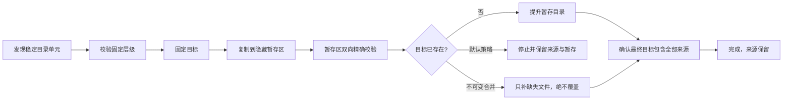

<div align="center">
  

  <p><strong>基于 rclone、理解底层分支、默认安全失败的媒体归档编排器。</strong></p>

  <p>
    <a href="README.md">English</a> ·
    <a href="docs/ARCHITECTURE.md">架构</a> ·
    <a href="docs/OPERATIONS.md">运维</a> ·
    <a href="SECURITY.md">安全</a>
  </p>
</div>

---

Atomic Sync 把一个电影目录、整部剧或一个季视为不可拆分的复制单元：先暂存、再校验、然后发布，并再次校验最终目标。**v0.1.x 仅支持复制**：程序绝不删除来源，API 与 Runner 都会拒绝 `mode: move` 和 `deleteSource: true`。

它还会检查 mergerfs 合并视图隐藏的真实情况：两个底层分支出现同名目录，**不代表归档已经完成**。程序会比较 StorageBox 与 GD 等物理分支中每个单元的相对文件路径和大小，区分已归档、待强校验、部分归档、待归档、冲突与空目录。

## 为什么普通移动命令会拆散剧集

`rclone move --min-age 30d` 按单个文件判断年龄。后加入的字幕、海报或剧集会留下，而旧视频先被移动，最终同一个媒体目录分散在两个位置。

Atomic Sync 读取整个单元中最新文件的修改时间。稳定窗口为 30 天时，只有完整目录连续 30 天没有变化才进入候选队列。进入候选不代表允许删除；来源清理属于外部人工流程，必须先停止所有写入者。

## 安全协议



- 新任务默认 `dry-run`。
- v0.1.x 仅支持复制；API 与 Runner 拒绝移动模式和 `deleteSource`，官方镜像不包含 rclone 的 `purge` 命令。
- 目标已存在时默认安全失败。
- `merge-immutable` 只补缺失内容，不覆盖同路径不同文件。
- 执行单元必须是固定分组深度上的目录；浅层文件、父子单元重叠会在发布前让整个运行安全失败。
- 暂存区必须与完整来源目录单元双向完全一致；新建目标的最终校验也必须双向一致，只有 `merge-immutable` 使用单向最终校验以保留已审核的目标侧额外文件。
- 目录目标归属写入 SQLite，重启与重试不会重新分流。
- 不同任务不能配置相同或互相嵌套的来源/目标路径，避免并发任务交叉操作。
- SIGTERM 会取消并等待任务；异常退出留下的非终态记录在重启时标记失败，暂存内容保留。
- UI 支持英文/简体中文；API Token 只保存在当前浏览器标签页。
- 容器使用 UID 1000、只读根文件系统、零 capabilities 和 `no-new-privileges`。

## mergerfs 底层归档判断

宏观状态不是按“有没有同名文件夹”判断，而是按内部文件清单判断：

| 状态 | 含义 | 建议动作 |
|---|---|---|
| `archived`（已归档） | GD 有内容，来源已经没有文件（可残留空目录壳） | 确认挂载健康并保留审计记录 |
| `ready-to-verify`（待强校验/清理） | 来源的相对路径和大小全部能在 GD 对应，但来源仍在 | 停止写入、独立完成最终校验，再按人工流程清理 |
| `partial`（部分归档） | GD 中已有部分内容，但仍缺少来源文件 | 不可变合并或人工核对 |
| `pending`（待归档） | 来源有文件，目标不存在该单元 | 归档候选 |
| `conflict`（冲突） | 相同相对路径的大小/类型不同，或文件出现在非分配目标分支 | 立即停止，人工选择权威副本与分支 |
| `empty`（空目录） | 只有空目录壳 | 检查或忽略 |

`partial` 也包括两个分支只有互补零散文件的情况：即使来源文件覆盖率为 0%，只要 GD 已有该电影或剧集的其他文件，宏观上仍属于部分归档。目标侧只有一个空目录壳时仍是 `pending`，不能算部分归档或已归档。

控制台分析只读取路径和大小，避免为了画面扫描就读取数 TB 的 CIFS 文件；任何外部人工来源删除仍需要真正的最终校验。完整规则见 [归档分析说明](docs/ARCHIVE-ANALYSIS.md)。

`archived` 是根据当前物理分支清单推断的状态，不是某次成功运行的历史证明。全部归档完成后，来源成功返回空清单是合法状态，所以分析前必须先确认物理挂载健康。参考 Compose 会拒绝自动创建缺失的 bind 来源，但无法区分“健康的空共享”和“目录仍在、底层文件系统已离线”。

### 校验模式

- `verify: checksum` 执行 `rclone check --download`。它会读取双方每个待比较文件的完整内容，不依赖后端是否提供兼容哈希，但会产生显著的 CIFS、网络与 Drive I/O。
- `verify: size` 使用仅大小比较，只核对路径与字节数，不读取文件内容，因此保证更弱。

来源到暂存的闸门会对完整目录单元做双向精确校验：暂存区多一个或少一个对象都会阻止发布。新建目标的最终闸门也必须双向精确匹配；只有 `merge-immutable` 使用单向最终校验，允许保留已审核的海报、字幕或早期归档文件。

## 快速开始

需要 Docker Engine、Compose v2 和现有 `rclone.conf`。

```bash
git clone https://github.com/yuanweize/atomic-sync.git
cd atomic-sync
mkdir -p data rclone source
cp /path/to/rclone.conf rclone/rclone.conf
cp .env.example .env
openssl rand -hex 32
```

把生成的 Token 写入 `.env`，然后只处理 Atomic Sync 的专用目录权限。rclone 会通过“临时文件 + 原子重命名”刷新 OAuth token，因此专用 `rclone` 目录必须可写；**绝不要对共享媒体根目录递归 `chown`**。

```bash
sudo chown -R 1000:1000 data
sudo chown -R 1000:1000 rclone
sudo chmod 700 rclone
sudo chmod 600 rclone/rclone.conf
docker compose -f compose.yaml -f compose.dev.yaml up -d --build
docker compose ps
```

打开 `http://127.0.0.1:8088`，输入 API Token。第一次只创建“复制 + 仅演练”任务。默认来源挂载为容器内 `/sources/media`，并且是只读的。NUE 的 v0.1.x 首发会把 `/data/storagebox/media` 只读挂载到 Atomic Sync，并先分别运行电影、电视剧 dry-run 任务，再考虑单个复制 canary。

## 生产部署

正式 Release 会生成带 SBOM、provenance 和 keyless 签名的 `linux/amd64`、`linux/arm64` 镜像。生产必须固定 Release digest：

```yaml
services:
  atomic-sync:
    image: ghcr.io/yuanweize/atomic-sync:0.1.3@sha256:<release-digest>
```

把服务嵌入其他 Compose 项目时不要使用 `build: .`，否则构建上下文会变成对方项目目录。

官方镜像只链接 rclone 的 `local`、`drive`、`crypt` 后端以及 Atomic Sync
实际调用的命令，覆盖 StorageBox/CIFS → Google Drive 场景，同时缩小运行时攻击面。
如需其他 rclone 后端，应基于审核过的自定义镜像构建，而不是在生产中临时替换二进制。

每个 GitHub Release 都包含 `image-digest.txt`、Linux 二进制文件和 `SHA256SUMS`。发布流程要求 GHCR 包已公开；匿名读取不可用时会安全失败。它逐平台检查 SBOM/provenance 和漏洞，再使用 GitHub OIDC 对不可变 digest 签名并回验。首次发布可能需要在 GitHub Packages 中手动设为 Public，然后重跑失败的工作流。部署前可这样验证：

```bash
IMAGE="$(cat image-digest.txt)"
docker pull "$IMAGE"
cosign verify "$IMAGE" \
  --certificate-identity-regexp '^https://github.com/yuanweize/atomic-sync/.github/workflows/release.yml@refs/tags/v[0-9]+\.[0-9]+\.[0-9]+$' \
  --certificate-oidc-issuer 'https://token.actions.githubusercontent.com'
sha256sum -c SHA256SUMS
```

## 配置

| 环境变量 | 默认值 | 用途 |
|---|---:|---|
| `ATOMIC_LISTEN` | `127.0.0.1:8080` | HTTP 监听地址；容器会显式设置为 `:8080` |
| `ATOMIC_DATA_DIR` | `/data` | SQLite 与持久化状态目录 |
| `ATOMIC_API_TOKEN` | 空 | Bearer Token；设置后至少 32 个字符，非 loopback 监听必须配置 |
| `ATOMIC_RCLONE_BIN` | `rclone` | rclone 可执行文件 |
| `ATOMIC_MAX_CONCURRENCY` | `2` | 全局 rclone 进程并发上限 |
| `ATOMIC_RCLONE_TRANSFERS` | `2` | 每个 rclone 进程内的并行传输上限 |
| `ATOMIC_RCLONE_CHECKERS` | `2` | 每个 rclone 进程内的并行检查上限 |
| `ATOMIC_RCLONE_TPS_LIMIT` | `2` | 每进程后端每秒事务上限，burst 固定为 1 |
| `ATOMIC_LOG_FORMAT` | `json` | `json` 或文本结构化日志 |
| `RCLONE_CONFIG` | `/config/rclone/rclone.conf` | 明确的 rclone 配置路径 |
| `RCLONE_CONFIG_DIR` | `./rclone` | Compose 绑定专用可写配置目录时使用的宿主路径 |

应用本身不会写入 `.env` 或编辑 rclone 配置，但子进程 rclone 可能在专用 `/config/rclone` 绑定目录中原子持久化刷新后的 OAuth token。该目录应设为 `0700`，`rclone.conf` 设为 `0600`；容器根文件系统和媒体来源挂载仍严格只读。任务、目标归属、运行历史与分支分析结果均保存在 `atomic-sync.db`。本地来源只能位于 `/sources/...`，本地目标只能位于 `/destinations/...`，远程来源会被拒绝。v0.1.x 必须复制完整目录单元，不接受 include/exclude 过滤器。

## 真实保证边界

Atomic Sync 提供分阶段、可校验的复制发布协议。对象存储的目录操作不是真正的 ACID 事务，目标侧 `moveto` 可能由多个对象操作组成；v0.1.x 始终保留来源。

`merge-immutable` 也不是完全原子的：发现后续冲突前，部分缺失对象可能已经补到目标；但它不会覆盖不同的目标对象。即使运行成功，隐藏暂存副本也会作为恢复与审计材料保留，Atomic Sync 不会自动清理它。新目标的提升操作会把目标侧暂存目录移动为最终目录，因此不会留下单独的暂存副本。

来源删除不属于 v0.1.x 的信任边界。必须先停止 Sonarr/Radarr 导入器及该单元的所有其他写入者，独立校验最终目标，确认恢复副本，只用外部管理工具删除经过审核的那一个来源目录，重新扫描后再恢复写入。详见[运维文档中的人工来源清理流程](docs/OPERATIONS.md#manual-source-cleanup-outside-atomic-sync)。

SQLite 架构只支持一个 Atomic Sync 实例，不要让多个副本共享同一个数据库。

## 文档

- [架构与状态机](docs/ARCHITECTURE.md)
- [mergerfs 分支归档分析](docs/ARCHIVE-ANALYSIS.md)
- [生产运维、升级与回滚](docs/OPERATIONS.md)
- [HTTP API](docs/API.md)
- [威胁模型](docs/SECURITY-MODEL.md)
- [贡献指南](CONTRIBUTING.md)
- [安全策略](SECURITY.md)

## 开发验证

需要 Go 1.25 或更高版本。

```bash
gofmt -w .
go vet ./...
go test -race -cover ./...
ATOMIC_API_TOKEN="$(openssl rand -hex 32)" docker compose config
docker build -t atomic-sync:dev .
```

测试覆盖仅复制约束、暂存区精确校验、层级/冲突安全失败、不可变合并、关机恢复、鉴权、API、SQLite，以及 mergerfs 同名目录内部文件部分归档的判断。

## 路线图

- 定时轮询与文件系统监听适配器
- 对选定分析单元按需计算校验和
- 暂存内容续传与引导式清理
- Prometheus 指标、通知与细粒度 RBAC
- 面向远程 NAS 推送的多节点 Agent

项目使用 [MIT License](LICENSE)。
