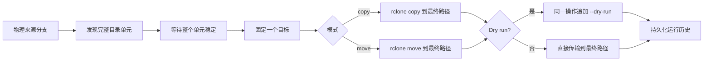

<div align="center">
  

  <p><strong>以完整目录为单位、由 rclone 全程执行的媒体归档控制面。</strong></p>

  <p>
    <a href="README.md">English</a> ·
    <a href="docs/ARCHITECTURE.md">架构</a> ·
    <a href="docs/OPERATIONS.md">运维</a> ·
    <a href="SECURITY.md">安全</a>
  </p>
</div>

---

Atomic Sync 面向本地或 CIFS 挂载来源到 Google Drive 的大规模媒体归档。它把一部电影、整部剧或一季识别成一个完整规划单元，等待整个单元稳定，固定目标分支，然后直接交给 rclone 完成数据传输。

它主要解决两个普通传输命令无法独立解决的问题：

- 后加入的一集、字幕或海报应该重置整个目录的稳定时间，不能让同一部剧被按单文件年龄拆到不同存储；
- mergerfs 合并视图中的同名目录，不代表两个物理分支已经完整归档，也可能是部分重叠、完全零散、冲突或空壳。

Atomic Sync 不替代 rclone，不代理文件内容，也不再实现一套 Google Drive 客户端。**rclone 是唯一数据面**；Atomic Sync 只负责策略、完整目录分组、目标分配、分支分析、运行历史和受保护的 Web 控制面。

## 只有两种模式

| 模式 | 数据操作 | 成功后的来源 | 目标侧额外文件 |
|---|---|---|---|
| `copy` | 直接复制到最终目标 | 保留 | 永不清理 |
| `move` | 直接移动到最终目标 | 由 rclone 在成功传输后删除 | 永不清理 |

项目不会提供第三个 `sync` 模式。rclone 的 `sync` 是**单向镜像**，可能删除目标侧独有文件，并不是双向同步；Atomic Sync 不需要这种目标清理语义。真正的双向同步属于另一类产品，Syncthing 也是独立实现，并不是基于 rclone。

## 为什么必须以完整目录为单位

`rclone move --min-age 30d` 按单个文件计算年龄。如果 40 天前已有海报，而最后一集昨天才下载完成，旧文件可能先被移动，最终同一部剧被拆散。

Atomic Sync 检查完整单元中最新文件的修改时间：

```text
电影分组       → Movie/
整剧分组       → Show/
季分组         → Show/Season 01/
自定义深度     → 严格 N 层目录
```

仓库默认稳定窗口是 **30 天**（`2,592,000` 秒）。三天（`259,200` 秒）只适合小范围 dry-run 或金丝雀测试，不是项目默认值。稳定窗口大于零时，同一个秒数也会作为 `--min-age <seconds>s` 传给 rclone，形成最后一道年龄保护。



## 面向高吞吐和可观测性

- **所有数据操作都由 rclone 完成。** 重试、限速、可恢复传输、检查和 Drive 行为都留在成熟的数据面。
- **直接写最终路径。** 不会为了发布再上传一份目标暂存副本。
- **绝不镜像删除目标。** 两种模式都不会调用 rclone `sync`。
- **默认真实 dry-run。** 使用同一 rclone 操作追加 `--dry-run` 检查两端；来源和目标媒体对象不变，但 rclone 可能在专用配置目录刷新 OAuth Token。
- **目录边界安全失败。** 浅层文件、路径穿越、父子单元重叠、端点重叠和保留内部路径都会阻止执行。
- **不可变冲突策略。** 默认策略在目标单元已存在时停止；显式合并只补缺失文件，不覆盖不同的目标对象。
- **固定目标分配。** 加权选择会写入 SQLite，重试不会把一个单元重新分流。
- **多层并发上限。** 任务 worker、全局 rclone 进程、进程内 transfers/checkers 和服务商 TPS 分开控制。
- **容器默认加固。** 固定 UID/GID 1000、只读根文件系统、零 capabilities 与 `no-new-privileges`。

直接传输是明确的性能选择。跨服务商 move 不是 ACID 目录重命名：rclone 按对象传输并确认，进程中断时两个分支可能出现部分完成状态。rclone 启动前，Atomic Sync 会重新列出来源并要求它与发现指纹一致，再把已发现文件路径写入临时 `--files-from-raw` 清单；rclone 因而只处理这个固定集合，不会顺带传输复检后才到达的文件。操作结束即删除清单；它只是控制数据，不是 staging 或媒体副本。每次非 dry-run copy/move 后都会列出最终目标，要求发现指纹中的每个文件路径和大小存在；move 再检查来源残留。这不会进行第二份内容传输，还能减少重复来源遍历，但元数据闭环无法锁住写入者，也不能证明保留旧修改时间的等大小原地改写。生产 move 仍必须停止写入者。

## mergerfs 底层归档状态

mergerfs 可以把 StorageBox 和 GD 的文件合并成一个看似完整的目录。Atomic Sync 会分别列出物理分支，并按固定目标比较单元内的相对路径和大小。

| 状态 | 物理含义 | 运维判断 |
|---|---|---|
| `archived`（已归档） | 目标有文件，来源没有文件 | 当前内容位于归档分支；先确认挂载健康 |
| `ready-to-verify`（待校验） | 每个来源路径和大小都能在目标找到，但来源仍保留 | 看似重复，等待明确的校验决策 |
| `partial`（部分归档） | 目标已有内容，但缺少一个或多个来源文件 | 传输未完成，或两个分支是互补零散内容 |
| `pending`（待归档） | 来源有文件，目标单元没有文件 | 尚未归档 |
| `conflict`（冲突） | 路径的大小/类型不同，或内容位于错误的分配目标 | 停止并选择权威分支 |
| `empty`（空目录） | 两侧都没有文件，可能只剩空目录壳 | 信息状态；检查或忽略 |

同名文件夹绝不是完成证明。例如 StorageBox 只有 `main.mkv`，GD 只有 `poster.jpg`，即使两侧都存在电影目录、GD 对来源文件覆盖率为 0%，宏观状态仍然是 `partial`。GD 只有空目录时仍是 `pending`。

控制台分析只读取路径和大小，避免刷新页面就读取数 TB 的 CIFS 内容。它是运维清单，不是内容完整性证明。完整规则见[底层分支归档分析](docs/ARCHIVE-ANALYSIS.md)。

## 快速开始

需要 Docker Engine、Compose v2，以及已配置目标 remote 的 `rclone.conf`。

```bash
git clone https://github.com/yuanweize/Atomic-Sync.git
cd atomic-sync
mkdir -p data rclone source
cp /path/to/rclone.conf rclone/rclone.conf
cp .env.example .env
```

生成至少 32 字符的 API Token 并写入 `.env`：

```bash
openssl rand -hex 32
```

准备两个可写的专用目录。rclone 需要通过临时文件和原子重命名保存 OAuth 刷新结果，因此只能挂载 Atomic Sync 自己的配置目录，不能复用主机全局配置。

```bash
sudo chown -R 1000:1000 data rclone
sudo chmod 700 rclone
sudo chmod 600 rclone/rclone.conf
docker compose -f compose.yaml -f compose.dev.yaml up -d --build atomic-sync
docker compose ps atomic-sync
```

打开 `http://127.0.0.1:8088`，输入 Token，先创建暂停的 dry-run 任务。参考 Compose 把 `/sources/media` 挂载为只读：它可以安全运行 `copy` 和任意模式的 dry-run；真正的 `move` 必须按[运维手册](docs/OPERATIONS.md)显式审核并更改来源挂载权限。

### 最小安全任务

```json
{
  "name": "Archive stable movies",
  "source": "/sources/media/movies",
  "destinations": [
    {"name": "gd-primary", "path": "GD:media/movies", "weight": 1}
  ],
  "mode": "copy",
  "deleteSource": false,
  "grouping": "folder",
  "settleSeconds": 2592000,
  "concurrency": 1,
  "verify": "size",
  "conflictPolicy": "fail",
  "dryRun": true,
  "paused": true
}
```

`copy` 必须配合 `deleteSource: false`；`move` 必须配合 `deleteSource: true`。两种模式都可以独立选择冲突策略和校验方式：首次运行优先使用 `fail`；`merge-immutable` 只补齐目标缺失对象且不覆盖目标；`size` 速度最快；当两端存在共同哈希时，`checksum` 能提供更强证据。所有 move 都使用 rclone 原生 `--ignore-existing`：目标同路径已存在时保留来源，并将单元报告为部分完成，绝不猜测内容相等后删除。由于 rclone 会跳过该重叠路径，`verify: checksum` 不会证明它的内容；清理前仍须独立内容校验。

创建 move 演练任务时，只需把示例中的 `mode` 改为 `move` 并将 `deleteSource` 改为 `true`。真实 move 还需要在启动时输入完整任务名，并明确把来源挂载改为可写。

## 生产部署

每个 Release 都会发布带 SBOM 和 provenance 的签名 `linux/amd64`、`linux/arm64` 镜像。生产环境同时固定版本与不可变 digest：

```yaml
services:
  atomic-sync:
    image: ghcr.io/yuanweize/atomic-sync:0.2.0@sha256:<release-digest>
```

先校验完整 Compose 模型，再只重建共享栈中的 Atomic Sync：

```bash
docker compose config --quiet
docker compose pull atomic-sync
docker compose up -d --no-deps atomic-sync
```

首次部署不要直接开启真实 move。依次检查底层分支、运行 dry-run、完成一个小型 copy 金丝雀；确认无误后，才停止所有写入者、只给最小来源目录写权限，并执行单单元 move 金丝雀。金丝雀必须把选定单元作为专用容器内父目录的唯一下一层，并把该父目录设为 `job.source`；具体作用域规则见[运维手册](docs/OPERATIONS.md#single-unit-canary-scope)。

从 v0.1 升级时，目标侧可能留有 `.atomic-sync-staging` 恢复数据。v0.2 不会创建、传输或删除该命名空间。任务校验会拒绝规范化路径中任一段恰好为 `.atomic-sync-staging` 的来源或目标端点；合法的父目标下仍可存在这个名称的遗留子目录，目标分析会忽略该子目录。任何显式人工清理前都必须先单独清点并独立校验这些遗留数据。

官方镜像只包含参考部署需要的 rclone 后端：local（包括主机上已挂载的 CIFS/SMB）、Google Drive 和 crypt。程序不会在自定义 API、主机复制工具和 rclone 之间动态切换。需要其他 rclone 后端时，应单独构建并审核自定义镜像。

## 校验与性能

`verify: size` 映射为 rclone 的 `--size-only` 传输比较，不读取文件内容。它是最快的金丝雀选择，但无法发现等大小损坏。

`verify: checksum` 映射为 rclone 的 `--checksum` 传输比较。存在双方兼容的哈希时由 rclone 进行比较；本地或 CIFS 挂载来源到 Google Drive 通常是读取来源计算 MD5、使用 Drive 已保存的哈希，而不是把两份文件都下载一遍。哈希可用性仍取决于后端。move 任务中的 `--ignore-existing` 会在 checksum 比较前跳过目标重叠路径，所以该设置不能证明保留重叠的内容。传输校验、重试和断点续传均由 rclone 负责。每次非 dry-run copy/move 后，Atomic Sync 只执行上述路径与大小完整性闸门；它不是第二次内容校验，也不是 `rclone check`。

如需少量关键单元的深度审计，可在停止写入后由操作员独立运行 `rclone check --download`。它会读取两侧完整内容，故意不作为 Atomic Sync 的常规校验路径。

吞吐量受四层配置控制：

| 变量 | 默认值 | 作用域 |
|---|---:|---|
| `ATOMIC_MAX_CONCURRENCY` | `2` | 所有任务合计的并发 rclone 进程 |
| `ATOMIC_RCLONE_TRANSFERS` | `2` | 每个进程内并行传输数 |
| `ATOMIC_RCLONE_CHECKERS` | `2` | 每个进程内并行元数据/哈希检查数 |
| `ATOMIC_RCLONE_TPS_LIMIT` | `2` | 每个进程每秒后端事务上限；`0` 表示不显式限制 |

配额敏感的 dry-run 金丝雀使用 `1/1/1/1`。追求 Drive 吞吐前，先配置独立的 Google OAuth `client_id` 和 `client_secret`；rclone 共享客户端不适合持续生产流量，并计划停止服务。之后监控 `403`/`429`、来源延迟和内存，逐步提高 transfers/checkers，尤其注意“进程并发 × 进程内传输数”的乘法效应。独立客户端经过压测确认还有余量后，可设置 `ATOMIC_RCLONE_TPS_LIMIT=0`，不再由 Atomic Sync 额外限制 TPS。Drive chunk size 属于 rclone/服务商配置，不是 Atomic Sync 自己的数据面实现。

## 安全边界

- 参考/生产部署的受保护 API 要求 Bearer Token。只有显式绑定 loopback 的开发进程可以无 Token；非 loopback 监听会拒绝缺失或过短 Token。
- 浏览器只把 Token 保存到当前标签页的 `sessionStorage`，不会写入 URL 或持久化 local storage。
- 程序通过参数数组启动 rclone，不经过 shell 拼接。
- 本地来源只能位于 `/sources`；本地目标只能位于 `/destinations`；远程来源会被拒绝。
- 不同任务的相同或嵌套路径会被拒绝；第一次目标分配后，影响放置的字段会被锁定。
- API Token 等同于挂载的 rclone 配置中所有目标 remote 的管理权限。
- 真正的 `move` 具有删除性。容器写权限、任务配置、显式确认和停止写入者是互相独立的运维责任。

SQLite 只支持一个 Atomic Sync 进程，不能让多个副本同时使用同一个数据库。

## 文档

- [架构与执行模型](docs/ARCHITECTURE.md)
- [底层分支归档分析](docs/ARCHIVE-ANALYSIS.md)
- [生产运维、恢复与回滚](docs/OPERATIONS.md)
- [HTTP API](docs/API.md)
- [威胁模型](docs/SECURITY-MODEL.md)
- [贡献指南](CONTRIBUTING.md)
- [安全策略](SECURITY.md)

## 开发

需要 Go 1.25 或更高版本。

```bash
gofmt -w .
go vet ./...
go test -race -cover ./...
ATOMIC_API_TOKEN="$(openssl rand -hex 32)" docker compose config --quiet
docker build -t atomic-sync:dev .
```

Atomic Sync 使用 [MIT License](LICENSE) 发布。
