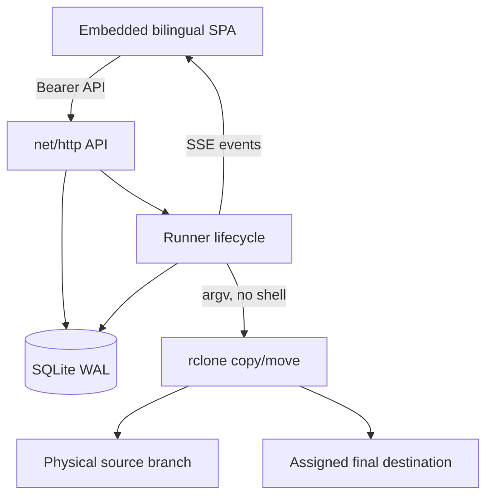
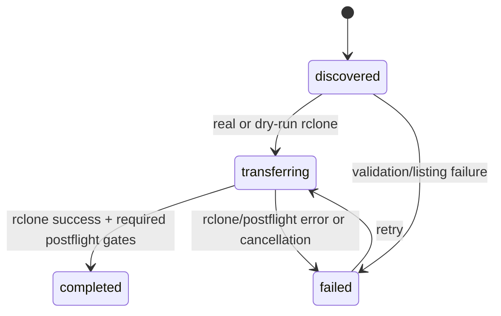

# Architecture and execution model

Atomic Sync is a single Go binary with an embedded bilingual browser UI, a REST/SSE API, a bounded rclone execution engine, and a single-writer SQLite store. Rclone is the only data plane: Atomic Sync supplies directory-unit grouping, safety policy, destination assignment, branch analysis, and durable control-plane history. The execution model is generic to regular files organized below a directory boundary; media-aware names are hierarchy presets over the same model.

## Components



- `cmd/atomic-sync`: configuration, logging, signal handling, startup reconciliation, and HTTP lifecycle.
- `internal/api`: authenticated JSON endpoints, static UI, CSP/security headers, job/run serialization, and SSE.
- `internal/engine`: grouping, physical-branch analysis, deterministic destination selection, bounded execution, and rclone argument construction.
- `internal/model`: job validation and run-state rules.
- `internal/store`: SQLite schema, jobs, assignments, analyses, and run history.
- `internal/api/ui`: dependency-free HTML/CSS/JavaScript UI.
- `build/rclone-main.go.in`: reviewed minimal rclone command/backend link set used by the official image.

## Two-mode data plane

The public contract intentionally exposes only two operations:

```text
copy → rclone copy  → source preserved
move → rclone move  → successfully transferred source objects removed
```

Both operations target the assigned final destination directly in one rclone invocation. Rclone owns per-object transfer verification, retries, resumability, and source removal semantics. Atomic Sync generates a temporary `--files-from-raw` manifest from the discovery fingerprint for every invocation, pinning rclone to the already reviewed file set and avoiding another unconstrained source-tree discovery. The manifest is removed when the invocation ends and never contains payload bytes.

`verify: checksum` maps to rclone `--checksum`; `verify: size` maps to `--size-only`. When `settleSeconds > 0`, the Runner also passes the same duration as `--min-age <seconds>s`. New transfer runs do not invoke a separate post-transfer content check. After every non-dry-run copy or move, the Runner uses `lsjson` on the final destination and requires every file in the discovery fingerprint to exist at the same relative path and byte size; under `fail`, it also rejects unexpected final paths. This is a metadata-completeness gate, not `rclone check`, checksum proof, staging, or a second content transfer. Rclone `sync` is deliberately absent because it can delete destination-only objects.

The Runner adds `--immutable` to protect existing objects. The `fail` policy performs a separate destination-unit preflight; `merge-immutable` streams rclone checks and transfers without `--check-first` so work begins immediately. Every move also adds `--ignore-existing` and `--delete-empty-src-dirs`: missing objects move at native rclone speed, while any destination-path overlap remains at source. Because ignored paths are not compared by `--checksum` or `--size-only`, they require independent content proof. Every non-dry-run transfer must pass the final path-and-size inventory gate; move then lists the source, and any residue converts the unit to failed/partial. Dry-runs invoke the same pinned operation with `--dry-run` and omit the final inventory gate; a real move additionally requires API/UI confirmation of the exact job name.

## Run state machine



Runs emit `discovered`, `transferring`, `completed`, and `failed`.

`completed` means that rclone returned success and a non-dry-run operation also passed the final metadata inventory; move additionally passed the source-residue check. For copy mode, source retention is intentional. For move mode, rclone has accepted the successful transfer/removal decision for the objects it handled; a distributed cross-provider directory transaction is not implied.

## Destructive-operation boundary

The model requires an explicit mode-specific contract:

- `mode: copy` with `deleteSource: false`;
- `mode: move` with `deleteSource: true`.

The API and Runner validate this pairing independently, including for dry-runs. Conflict policy (`fail` or `merge-immutable`) and verification (`size` or `checksum`) remain independent for both modes. The reference Compose source is read-only and jobs default to dry-run. Enabling real move requires a reviewed writable source bind, quiesced writers, and `X-Atomic-Confirm-Job` containing the exact job name. The API token is an Atomic Sync administrator secret, not a system password, and grants access to all configured destination remotes. It may be omitted only when the application process itself listens explicitly on loopback; a Tailscale-IP listener remains non-loopback and requires at least 32 characters.

## Execution-unit contract

An executable unit is always a directory at one fixed hierarchy boundary. The policies share one engine but have different operator-facing intent:

- `folder`: one top-level directory, for general directory trees;
- `depth`: exactly the configured positive number of directory components, for custom general trees;
- `show`: one top-level `Show` directory, a media preset with the same boundary as `folder`;
- `season`: exactly `Show/Season`, a two-level media preset.

The media presets only select those hierarchy boundaries. They do not parse or rename media, inspect episode or season completeness, or change transfer semantics. Transfer fingerprints and manifests contain regular files; symbolic links and special files are unsupported, empty directories are not guaranteed to be preserved, and POSIX ownership, permissions, extended attributes, and related metadata are outside the contract. This is not a filesystem-backup engine.

A root-level file, a show-level file in a season job, or any other item above the configured boundary is shallow and cannot become an executable file unit. Atomic Sync does not currently expose per-file grouping. Discovery also rejects a set containing both a directory and one of its descendants as separate units. These checks fail the complete run before rclone writes, preventing a loose file and one of its related directories from being transferred independently.

Immediately before each real or dry-run rclone operation, the Runner lists that source unit again, compares its paths, types, sizes, and modification times with the discovery fingerprint, and rechecks the stable window. It then gives rclone only the fingerprint's file paths through the temporary manifest, excluding files that arrive after revalidation. A new, removed, resized, retimestamped, or young file seen during revalidation stops the unit; `--min-age` independently rejects a too-young listed file when the stable window is positive. Every non-dry-run final inventory is checked against the same fingerprint, and move checks source residue afterward. These checks narrow the time-of-check/time-of-use race but are not a filesystem lock and cannot prove an in-place, equal-size rewrite that preserves its old modification time; production moves still require quiesced importers and download post-processing.

## Destination assignment

`job ID + unit path` is the assignment key. A deterministic FNV-1a weighted selection chooses an initial destination; SQLite persists it with `INSERT OR IGNORE`. Concurrent workers therefore converge on the same destination.

After the first unit receives an assignment, the API placement-locks source, grouping boundary, destination names, paths, weights, and ordering. This prevents an edit from silently splitting an already assigned directory unit across physical targets. Create a new job for a new placement policy.

## Execution concurrency

Each job uses a bounded worker pool based on `job.concurrency`. Workers also acquire a global semaphore configured by `ATOMIC_MAX_CONCURRENCY`, so multiple jobs cannot exceed the process-wide rclone-process ceiling. Every invocation additionally receives `ATOMIC_RCLONE_TRANSFERS` and `ATOMIC_RCLONE_CHECKERS`. `ATOMIC_RCLONE_TPS_LIMIT` adds a per-process cap when positive; zero omits both TPS flags. Process concurrency therefore does not silently multiply rclone's default internal parallelism. The engine never creates one goroutine per discovered unit.

Branch analyses use a separate single-slot semaphore and list destinations sequentially to reduce cloud API pressure.

## Shutdown and recovery

API-launched work belongs to the Runner context. On SIGTERM:

1. HTTP request contexts are canceled.
2. The server stops accepting work.
3. The Runner cancels rclone children and waits for workers.
4. SQLite closes after workers finish.

On the next start, any non-terminal run record or running analysis is marked `failed` with an interrupted message. This reconciles control-plane history only; files already transferred by rclone are not rolled back. Re-run branch analysis before retrying a partial direct operation.

## Storage model

SQLite uses WAL mode, a five-second busy timeout, and one open connection. This deliberately supports one process and simplifies assignment consistency. Horizontal replicas are not supported.

Tables:

- `jobs`: validated JSON job documents.
- `runs`: append-only execution history plus state transitions.
- `assignments`: stable unit-to-destination mapping.
- `analyses`: latest persisted physical-branch comparison per job.
- `settings`: reserved for forward-compatible application settings.

## Branch analysis

The analyzer lists each physical source/destination branch with `rclone lsjson --recursive`, groups paths by the job's unit boundary, and compares relative paths, type, and size. It reports `archived`, `ready-to-verify`, `partial`, `pending`, `conflict`, or `empty` without writing or deleting anything. The mergerfs union is never treated as proof of archive completion. See [Branch-aware archive analysis](ARCHIVE-ANALYSIS.md).

Analysis is metadata-first. `verify: size` and `verify: checksum` belong to the transfer operation; an analysis result does not claim checksum proof. An independent `rclone check --download` remains an optional operator-run deep audit.

Job validation rejects any source or destination endpoint whose normalized path contains a segment exactly named `.atomic-sync-staging`. An otherwise valid parent destination may contain a child with that name left by pre-v0.2 releases; destination analysis excludes that child. New runs never create, publish, transfer, or delete the namespace, and source discovery also fails closed if it encounters it below an allowed source endpoint. Legacy staging therefore remains external recovery evidence that must be inventoried, verified, and cleaned only by an explicit operator procedure.

## Publication and consistency semantics

There is no application-level publish phase. The final destination is the rclone target from the first transfer operation. `fail` stops when an existing destination unit is present. `merge-immutable` adds missing files directly and never overwrites a destination object. Move retains every overlapping source object and reports the unit partial; an independent content proof and explicit operator cleanup are required for those leftovers.

Remote object stores do not provide an ACID directory transaction. The protocol guarantees validated unit boundaries, deterministic placement, rclone-managed per-object transfer behavior, and durable evidence—not a distributed filesystem rename or automatic rollback.
