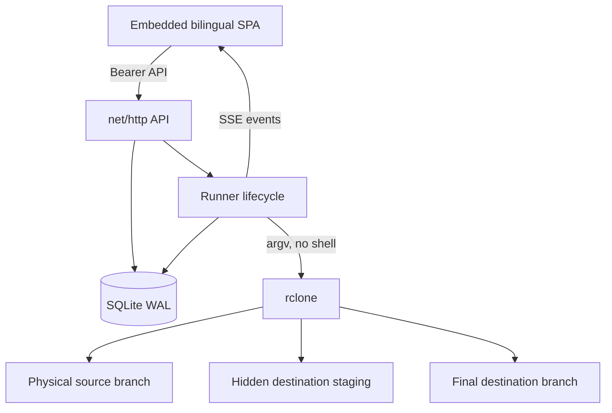
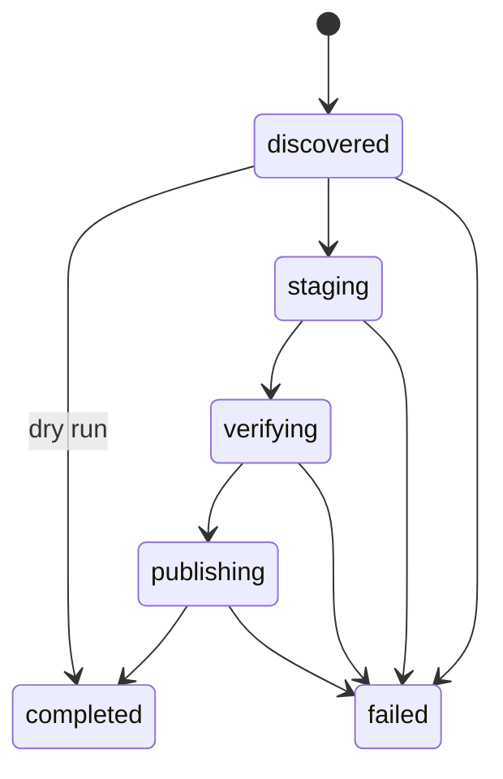

# Architecture

Atomic Sync is a single Go binary with an embedded browser UI, a REST/SSE API, a bounded rclone execution engine, and a single-writer SQLite store.

## Components

- `cmd/atomic-sync`: configuration, logging, signal handling, recovery, and HTTP lifecycle.
- `internal/api`: authenticated JSON endpoints, static UI, CSP/security headers, and SSE.
- `internal/engine`: grouping, deterministic destination selection, analysis, bounded execution, and the publication protocol.
- `internal/model`: job validation and state rules.
- `internal/store`: SQLite schema, jobs, assignments, analyses, and run history.
- `internal/api/ui`: dependency-free HTML/CSS/JavaScript UI.

## Run state machine

`failed` is terminal for one run record. A retry creates a new run and preserves the previous evidence and staging path.

## Destination assignment

`job ID + unit path` is the assignment key. A deterministic FNV-1a weighted selection chooses an initial destination, then SQLite persists it with `INSERT OR IGNORE`. Concurrent workers therefore converge on the same destination.

After the first assignment, the API placement-locks the source, grouping boundary, destination names, paths, weights, and ordering. This prevents an edit from silently splitting an already assigned media unit across physical targets. Create a new job for a new placement policy.

## Execution concurrency

Each job uses a bounded worker pool based on `job.concurrency`. Workers also acquire a global semaphore configured by `ATOMIC_MAX_CONCURRENCY`, so multiple jobs cannot exceed the process-wide ceiling. The engine never creates one goroutine per discovered unit.

Branch analyses use a separate single-slot semaphore and list destinations sequentially to reduce cloud API pressure.

## Shutdown and recovery

API-launched work belongs to the Runner context. On SIGTERM:

1. HTTP request contexts are canceled.
2. The server stops accepting work.
3. The Runner cancels rclone children and waits for workers.
4. SQLite closes after workers finish.

On the next start, any non-terminal run record or running analysis is marked `failed` with an interrupted message. Hidden staging data is never automatically deleted.

## Storage model

SQLite uses WAL mode, a five-second busy timeout, and one open connection. This deliberately supports one process and simplifies assignment consistency. Horizontal replicas are not supported.

Tables:

- `jobs`: validated JSON job documents.
- `runs`: append-only execution history plus state transitions.
- `assignments`: stable unit-to-destination mapping.
- `analyses`: latest persisted physical-branch comparison per job.
- `settings`: reserved for forward-compatible application settings.

## Publication semantics

For a new destination, staging is moved to the final path with `--immutable` after verification. For `merge-immutable`, missing staging files are copied to an existing final directory with `--immutable`; conflicts fail without overwriting. Both paths end with a source-to-final verification.

Remote object stores do not provide an ACID directory rename. The protocol guarantees preservation and verification boundaries, not a distributed filesystem transaction.
